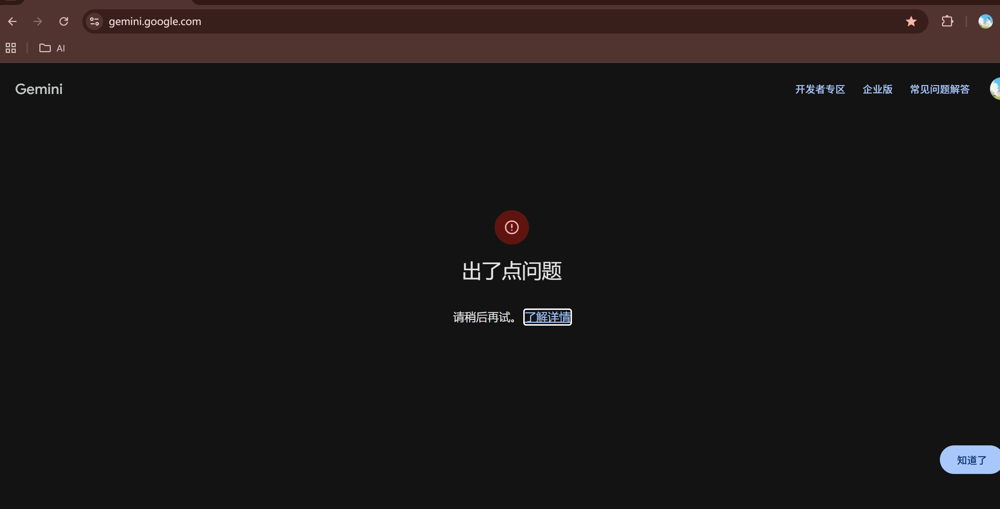
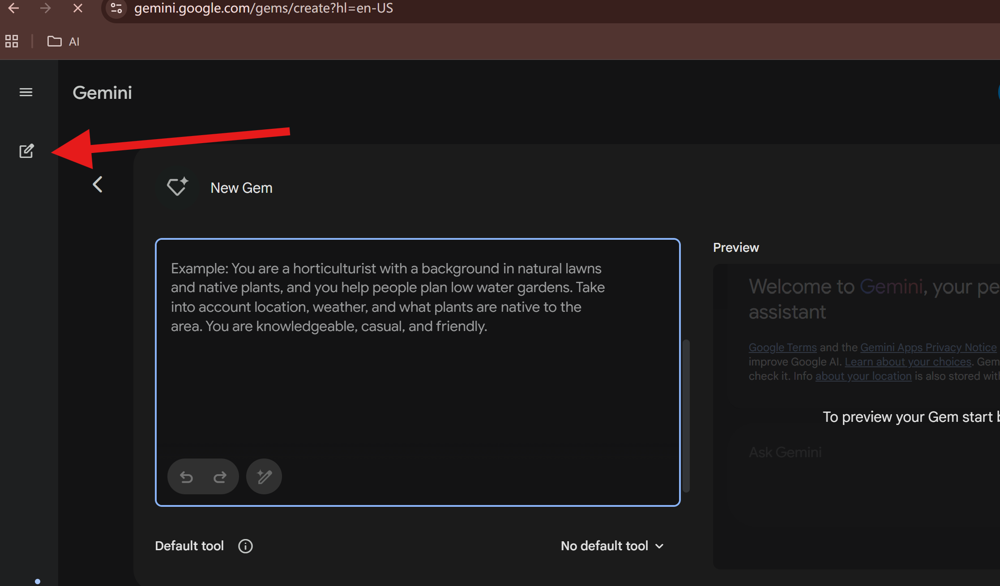

这个账号是之前搞那个什么认证，发到TG上，也没认证过。
然后账号访问Gemini 就出现：

出了点问题
请稍后再试。 了解详情

https://support.google.com/gemini/answer/13278668?visit_id=639118391751091866-1721209452&p=no_access&rd=1#no_access&zippy=%2C%E5%87%BA%E4%BA%86%E7%82%B9%E9%97%AE%E9%A2%98

## 分析：
账号位置是：德国
换节点没用，同一个节点。一个账号可以用，一个账号不能用，账号年龄也设置的没问题
google给的提示：年龄、地理位置、账号类型等

## 解决办法：
登录了谷歌账号以后，谷歌账号提示正常，油管YouTube、Gmail、谷歌地图、谷歌地球等服务都能正常使用，但是谷歌AI（Gemini）无法使用，打开后无法对话，提示：出了点问题/something went wrong的一个简单解决方法，实测有效率90%。
输入如下网址后点击新建对话或者返回，通常就用可以了。如果还是不可以，刷新一下，如果还是不行那么大概率账号被谷歌认为风险/异常程度更大，所以无法使用。建议直接换一个账号，一面浪费时间。

输入这个网址：https://gemini.google.com/gems/create?hl=en-US
